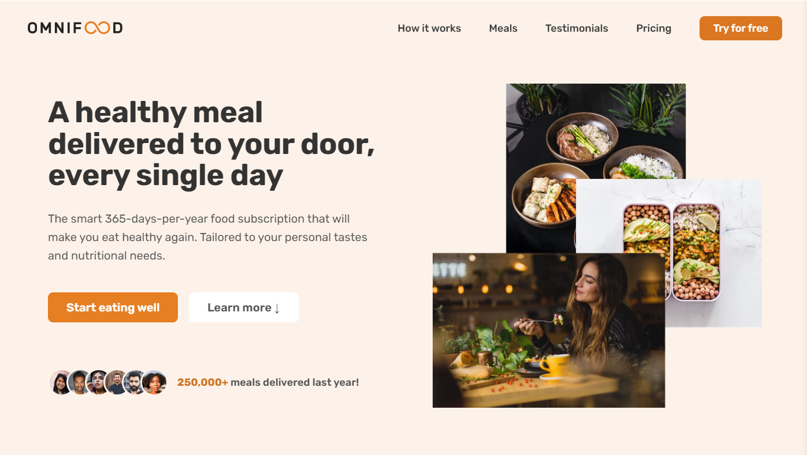
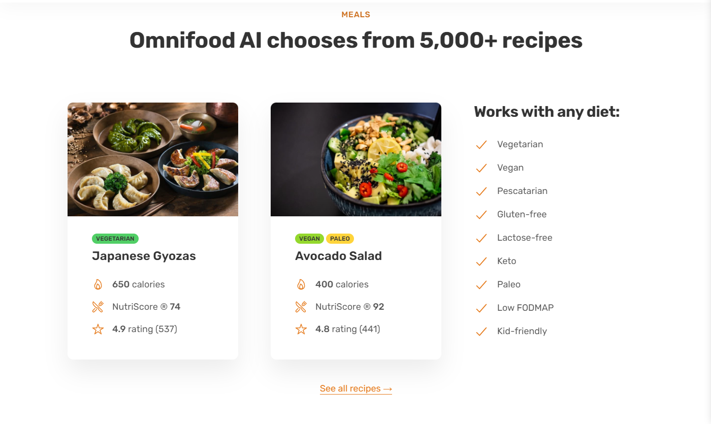
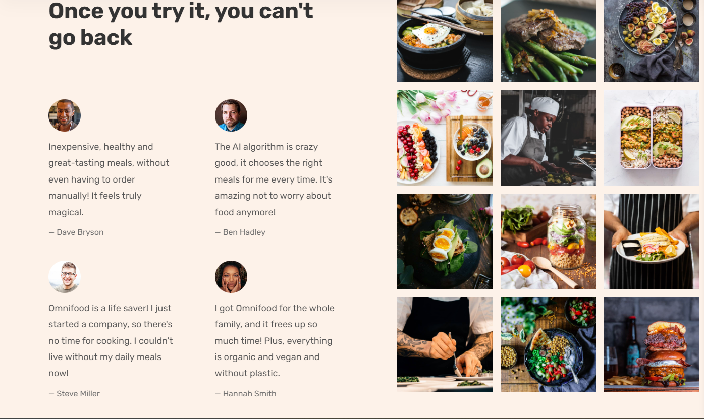

### Omnifood

#### A healthy mean delivered to your door, every single day!
Are you tired of cooking? Try Omnifood.

Omnifood is a project of a UDEMY.com course called "Build Responsive Real-World Websites with HTML and CSS Certificate".

It is only made using HTML and CSS. A super fun project that teaches you a lot!🧑‍🎓

  

